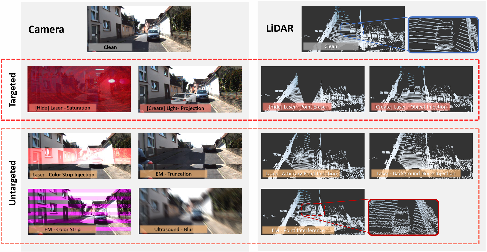

# Unity is Strength? Benchmarking the Robustness of Fusion-based 3D Object Detection against Physical Sensor Attack

<!-- [](https://github.com/sindresorhus/awesome) -->



Here, we present the _dataset_ and _source code_ for all corruptions. You can visit our [website](https://zjushine.github.io/PSA-Fusion/) for videos and the manuscript.

## Dataset: Kitti-Spoof
You can download [Kitti-Spoof (click here)](https://drive.google.com/drive/folders/1lM__ssa1u_4X2D8tLoEHmxVQTytnwz1I?usp=sharing) from google drive.

The KITTI-Spoof dataset, which used in this paper, is generated based on KITTI training dataset. The corrupted dataset KITTI-Spoof features 5 types of LiDAR attacks and 6 types of camera attacks. Different from traditional benchmarks, we take the physical sensor attacks into consideration during the corruption construction.


## Source Code
The physical sensor attacks can be simulated on other dataset based on following code.

### Setup
0.  Clone the repo:
```bash
git clone https://github.com/Jinzizhisir/PSA-Fusion.git
cd PSA-Fusion
```

1. Create a new conda environment and install the libraries:
```bash
conda create --name PSA_Fusion
conda activate PSA_Fusion
pip install -r requirements.txt
```

### How to Use ?
In the _main()_ function of _Main.py_, you have the option to freely select the type of corruption. After specifying the original data and output, running _Main.py_ will conveniently generate the corrupted data for you.

```python
def main():

    # The corruption you want to generate.
    Camera_Corruption = ['Hide_Laser_Saturation','Create_Light_Projection','Laser_Color_Strip_Injection','EM_Truncation','EM_Color_Strip','Ultrasound_Blur']
    LiDAR_Corruption = ['Hide_Laser_Point_Erase','Create_Laser_Object_Injection','Laser_Arbitrary_Point_Injection','Laser_Background_Noise_Injection','EM_Point_Interference']

    # The file path of original images and point cloud.
    img_file_pth = '.\Original_Dataset_Demo\Image' 
    point_cloud_file_pth = '.\Original_Dataset_Demo\PointCloud'

    Output_file_pth = '.\Output_Demo'

    for corruption_name in Camera_Corruption:
        process_images(corruption_name, img_file_pth, Output_file_pth)
    
    for corruption_name in LiDAR_Corruption:
        process_pointcloud(corruption_name, point_cloud_file_pth, Output_file_pth)
```

0. Select the corruption you want to generate. 
1. Specify the path to the original data.
2. Specify the output path
3. run _Main.py_
   ```bash
   python Main.py
   ```

## Appendix


<center>Table. The Performance(AP) of 11 Detectors on Kitti and Kitti-Spoof </center>


<center>Figure. The Average Precision (AP) of each model under clean datasets and various corruptions, a higher AP indicates better model performance.</center>


## Citation
If you find this useful for your research, please use the following.

```
@InProceedings{Realease soon}
```

## Acknowledgments
 - We acknowledge and appreciate the original authors for their support in open-sourcing the code. Acknowledge Chen Yan (yanchen@zju.edu.cn) for the _Laser_Color_Strip_Injection_; acknowledge Yushi Cheng (yushicheng@zju.edu.cn) for the _Ultrasound_Blur_; acknowledge Qinhong Jiang (qhjiang@zju.edu.cn) for the _EM_Truncation_ and _EM_Color_Strip_.
